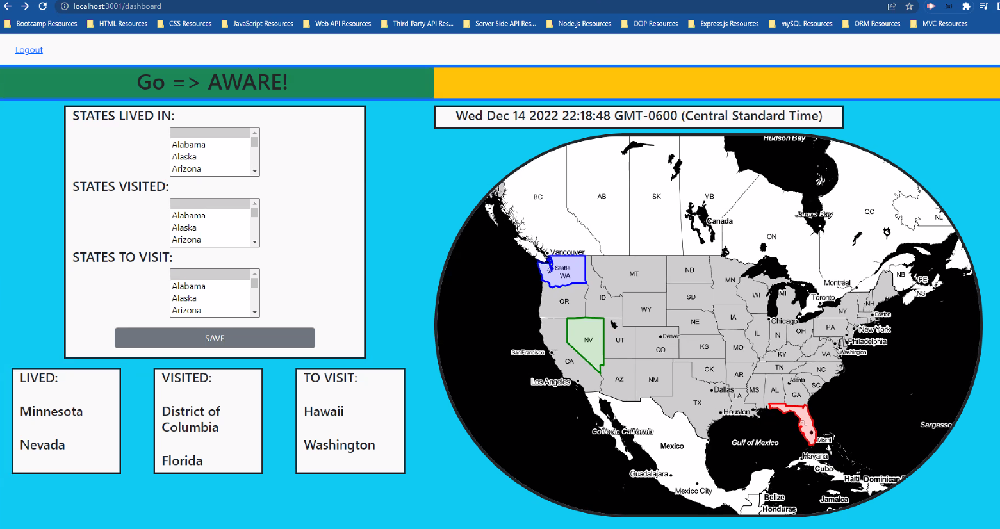
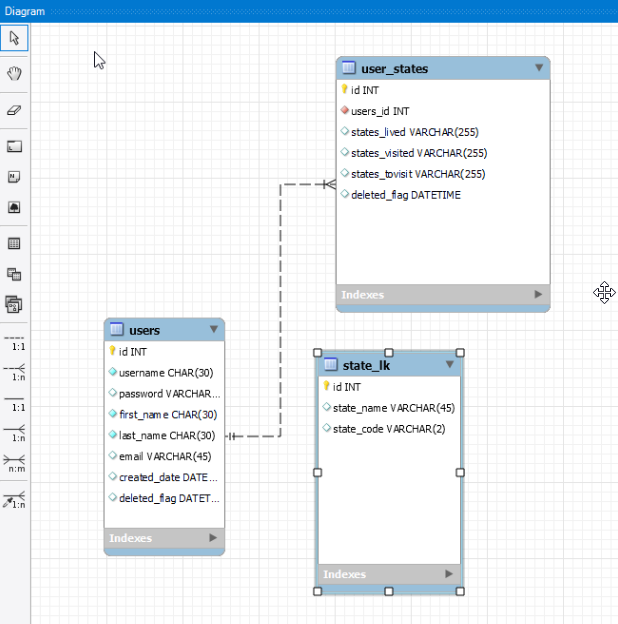

# GO > Aware


## Table of Contents

- [Description](#description)
- [User Story](#user-story)
- [Technologies Used](#technologies-used)
- [Acceptance Criteria](#acceptance-criteria)
- [Mock Up](#mock-up)
- [Deployed URL Link](#deployed-url-link)
- [GitHub Repository Link](#github-repository-link)
- [License](#license)
- [Credits](#credits)

## Description

An application that allows a user to create a map displaying US states lived in, visited and planning to visit. These selected states are then stored in a MySQL database
along with other users of the site.

## User Story

```
AS A Person curious about traveling and learning about the places people have lived and visited
I WANT to select from a list of US states to indicate where I've lived, visited and intend to visit
SO THAT the data can be saved in a MySQL database and also rendered on a map displayed in the browser.
THEN other users of the website can do the same and create maps of their travels to share.

```

## Technologies Used

```
* Node.js
* Express
* Handlebars
* MySQL Database
* Sequelize ORM
* Leaflet.js - NEW TECH!
* Heroku / JawzDB
```


## Acceptance Criteria

```

Our group worked to create a real-world full-stack application that provides secure login using Express-Session and stores user entered info in a backend SQL Database hosted at Heroku and running JawzDB. We are using a new library, Leaflet.js in order to render user selected states onto an interactive map. Our project fulfils the following requirements:

* Use Node.js and Express.js to create a RESTful API.

* Use Handlebars.js as the template engine.

* Use MySQL and the Sequelize ORM for the database.

* Have both GET and POST routes for retrieving and adding new data.

* Use at least one new library, package, or technology that we haven’t discussed.

* Have a folder structure that meets the MVC paradigm.

* Include authentication (express-session and cookies).

* Protect API keys and sensitive information with environment variables.

* Be deployed using Heroku (with data).

* Have a polished UI.

* Be responsive.

* Be interactive (i.e., accept and respond to user input).

* Meet good-quality coding standards (file structure, naming conventions, follows best practices for class/id naming conventions, indentation, quality comments, etc.).

* Have a professional README (with unique name, description, technologies used, screenshot, and link to deployed application).


```

## Mock-Up

* Sign In Page


* Map Dashboard



* MySQL ERD



## License
This application is utilizing the following License: MIT

## Deployed URL Link

https://go-aware.herokuapp.com/

## GitHub Repository Link

https://github.com/Nwsheats/Go-Aware

## Credits
```
Nathan Sheats
Ruharo Denis
Conor Donnelly
```